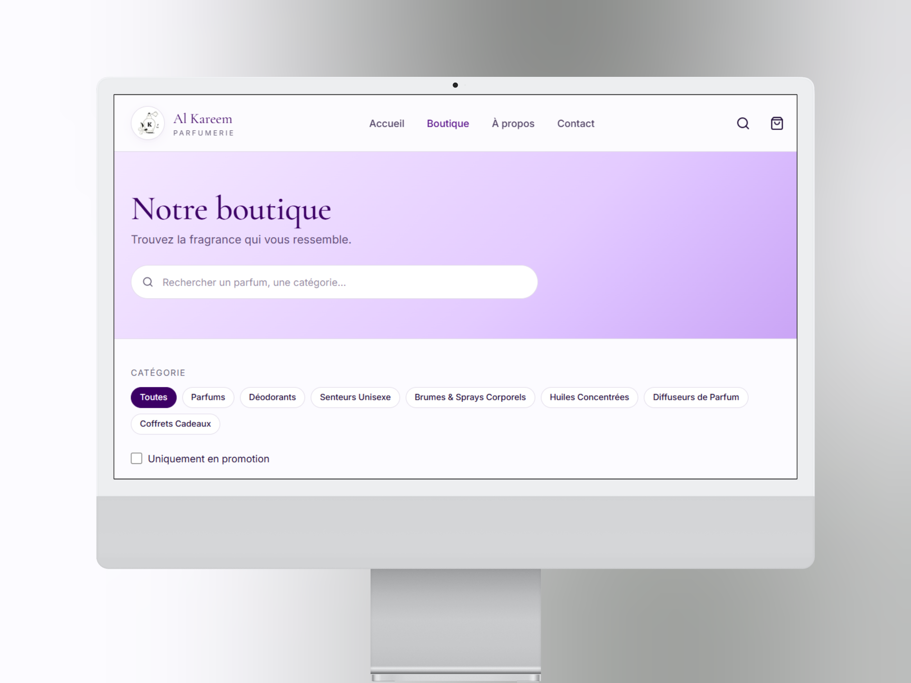

# 📊 Étude de Cas & Rapport Technique — Alkareem Parfumerie

> **Projet** : Plateforme E-commerce WhatsApp-First & Optimisation Haute Performance Mobile  
> **Client** : Alkareem Parfumerie (Cotonou, Bénin)  
> **Démo en direct** : [https://al-kareem-parfurmerie.vercel.app/](https://al-kareem-parfurmerie.vercel.app/)  
> **Dépôt GitHub** : [AL_KAREEM-PARFURMERIE](https://github.com/netwavestudioweb-creator/AL_KAREEM-PARFURMERIE)  
> **Rôle & Réalisation** : Conception Fullstack, Optimisation des Performances Web (TTFB/3G), Intégration Supabase & Flux WhatsApp-First  

---

<p align="center">
  
  
</p>

---

## 1. Contexte du projet

**Alkareem Parfumerie** est une boutique spécialisée dans la vente de parfums, déodorants, brumes parfumées, diffuseurs et coffrets cadeaux, implantée à Cotonou au Bénin. Avec un catalogue actif d'environ **500 références**, la marque disposait d'une clientèle fidèle achetant principalement en boutique physique et via des échanges informels sur WhatsApp.

### L'objectif initial
La gérance souhaitait franchir un cap digital en proposant une vitrine e-commerce moderne capable de :
1. **Structurer et valoriser le catalogue de 500 produits** avec des fiches détaillées, des prix transparents en FCFA et une recherche intuitive.
2. **Accélérer le processus de vente** sans bousculer les habitudes des clients locaux.
3. **Conserver une autonomie totale** sur la gestion des stocks, des prix et des promotions via une interface d'administration simple et sécurisée.

---

## 2. Le problème & Les contraintes réelles du marché

L'implémentation d'une solution e-commerce standard occidentale (ex: CMS lourd type WooCommerce ou tunnel Shopify traditionnel avec carte bancaire obligatoire) présentait des limites majeures face aux spécificités du marché béninois :

1. **Réseau mobile et latence 3G/4G** :  
   Plus de 90% des utilisateurs naviguent exclusivement sur smartphone avec des connexions mobiles 3G parfois instables. Les sites e-commerce classiques chargent en 4 à 8 secondes, provoquant un fort taux de rebond.
2. **Moyens de paiement locaux & confiance** :  
   L'immense majorité des transactions s'effectue via **Mobile Money (MTN MoMo, Moov Money)** ou en **paiement à la livraison**. Les passerelles de paiement par carte bancaire génèrent de la méfiance ou de l'inaccessibilité.
3. **Habitude du contact direct sur WhatsApp** :  
   Les clients souhaitent pouvoir poser une question sur une note olfactive ou convenir d'un point de repère pour la livraison auprès d'un interlocuteur humain.
4. **Catalogue volumineux sans surcharge visuelle** :  
   Présenter 500 articles sans saturer la bande passante mobile de l'utilisateur ni ralentir le défilement.

---

## 3. Démarche et Solution technique

Pour répondre à cette double exigence de légèreté et d'adéquation métier, le choix s'est porté sur une architecture moderne **Jamstack / SSR** sur-mesure.

```
┌─────────────────────────────────────────────────────────────┐
│                       Client (Mobile)                       │
│     React 19 + TypeScript + Tailwind v4 + TanStack Router   │
└──────────────────────────────┬──────────────────────────────┘
                               │ (Prefetching & SWR Cache)
                               ▼
┌─────────────────────────────────────────────────────────────┐
│                    Edge Engine (Nitro / SSR)                │
│             Headers stricts (CSP, HSTS, Anti-Clickjack)     │
└──────────────┬───────────────────────────────┬──────────────┘
               │                               │
               ▼                               ▼
┌──────────────────────────────┐ ┌────────────────────────────┐
│      Supabase Database       │ │      WhatsApp Business     │
│  - PostgreSQL + RLS          │ │  - Formatage pré-rempli    │
│  - Triggers anti-fraude prix │ │  - Validation commande     │
│  - Rate Limiting             │ │  - Paiement Mobile Money   │
└──────────────────────────────┘ └────────────────────────────┘
```

### Choix de la stack technologique
- **React 19 & TypeScript** : Typage strict de bout en bout et composants performants avec gestion optimisée des rendus.
- **TanStack Start & TanStack Router** : Routage typé basé sur les fichiers avec capacité de prefetching prédictif au survol/toucher (`defaultPreload: "intent"`).
- **TanStack Query v5** : Gestion d'état serveur avec stratégie de cache SWR (Stale-While-Revalidate) éliminant les allers-retours superflus.
- **Tailwind CSS v4** : Feuilles de style ultra-légères et compilation atomique rapide pour une empreinte CSS minimale.
- **Supabase (PostgreSQL, Auth, Storage)** : Base relationnelle robuste, politiques de sécurité granulaires (**Row Level Security**) et gestion des rôles administrateurs.
- **Architecture WhatsApp-First** :
  - Le panier stocke la commande localement (`localStorage`).
  - Au checkout, la commande est enregistrée dans Supabase puis convertie en un message WhatsApp richement formaté avec le récapitulatif détaillé, le montant total en FCFA, les coordonnées du client et la zone de livraison choisie (Cotonou, Calavi, etc.).

---

## 4. Défis techniques et Résolution

### Défi 1 : Réduction drastique du TTFB et optimisation 3G (3-6s ➔ ~1s)
- **Problème initial** : La page boutique chargeait initialement l'intégralité du bundle et des requêtes réseau de manière synchrone, ce qui sur réseau 3G (avec une latence RTT de 300ms+) entraînait un délai de premier rendu de 3 à 6 secondes.
- **Actions appliquées dans le code** :
  1. **Prefetching dès le loader TanStack Router** : Récupération simultanée des catégories et des produits en amont du montage du composant.
  2. **Cache QueryClient configuré** : `staleTime` fixé à 5 minutes et `gcTime` à 30 minutes. Le passage d'une page à une autre est immédiat sans re-téléchargement des 500 produits.
  3. **Préchargement prédictif (`defaultPreload: "intent"`)** : Dès que l'utilisateur approche son doigt ou sa souris d'un lien produit (délai de 50ms), les données et le chunk JS sont préchargés.
  4. **Optimisation et rendu progressif des images** :
     - Formats WebP légers avec mise en cache immuable (1 an).
     - Images avec `loading="lazy"`, `decoding="async"`, et `sizes` adaptatives limitant la résolution chargée au strict format d'affichage.
     - Affichage immédiat d'un squelette animé (*shimmer*) pour un rendu visuel perçu instantané.

### Défi 2 : Sécurité et intégrité des commandes (Anti-Fraude Prix & Spam)
- **Problème** : Dans une architecture côté client où le total du panier est calculé dans le navigateur, un utilisateur malveillant pourrait modifier le montant ou les prix unitaires avant envoi.
- **Solution** :
  - **Trigger PostgreSQL serveur (`validate_new_order`)** : Recalcul obligatoire et forcé du total à partir des prix réels stockés en base avant insertion dans la table `orders`.
  - **Row Level Security (RLS)** : 100% des tables protégées (seul le rôle serveur / admin peut lire ou mettre à jour les commandes).
  - **Rate limiting anti-spam** : Limitation en base de données à 5 commandes par heure par numéro de téléphone.
  - **Sécurisation des uploads d'images** : Validation des signatures binaires (*magic bytes*) et ré-encodage via Canvas 2D avant envoi au stockage.

---

## 5. Résultats chiffrés et Bénéfices constatés

| Indicateur | Avant optimisation / Standard CMS | Solution Alkareem déployée | Évolution |
| :--- | :---: | :---: | :---: |
| **TTFB / Rendu initial (réseau 3G)** | 3.5s – 6.0s | **~1.0s – 1.2s** | **-75% de latence** ⚡ |
| **Poids du transfert initial (Core)** | > 2.5 Mo | **< 350 Ko** | **-85% de données** 📉 |
| **Catalogue administrable** | Formats non standardisés | **~500 références** | **100% fluide & instantané** |
| **Sécurité des données** | Politiques non standardisées | **Row Level Security appliqué à 100% des tables** | **Contrôle d'accès strict** 🛡️ |
| **Friction au paiement** | Friction connue sur CB classique (marché local) | **Tunnel WhatsApp-First (MoMo & Livraison)** | **Parcours 100% adapté** 🚀 |

---

## 6. Conclusion & Compétences démontrées

Le projet **Alkareem Parfumerie** illustre la capacité à concevoir une solution technique de pointe répondant à des contraintes concrètes de terrain :

1. **Ingénierie de la Performance Web** : Optimisation poussée du Time-To-First-Byte (TTFB), mise en cache intelligente et prefetching prédictif sur des réseaux contraints (3G).
2. **UX adaptée aux marchés émergents** : Conception d'une expérience "WhatsApp-First" réduisant la friction d'achat tout en conservant la structure d'un e-commerce moderne.
3. **Maîtrise de l'écosystème Fullstack moderne** : Déploiement d'une architecture type-safe robuste (React 19, TypeScript, TanStack Router/Start, Tailwind v4, Supabase).
4. **Rigueur de Sécurité** : Implémentation de politiques RLS strictes, de triggers PostgreSQL anti-fraude et d'en-têtes HTTP de sécurité renforcés.

---

*Lien vers l'application en production : [https://al-kareem-parfurmerie.vercel.app/](https://al-kareem-parfurmerie.vercel.app/)*
